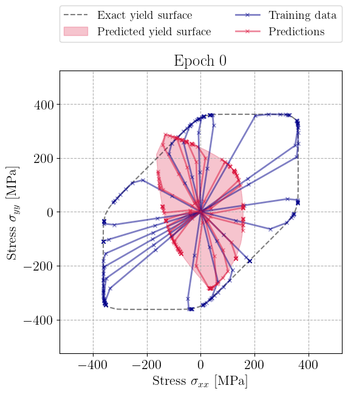

# Learning elastoplasticity with implicit layers

[](https://doi.org/10.5281/zenodo.15168994)

<p align="center">

</p>

This repository provides the code and examples for the paper:

> **Learning elastoplasticity with implicit layers**, by *Jérémy Bleyer*

The project explores a novel machine learning framework that integrates elastoplastic material models with implicit layers using differentiable convex optimization. This approach is particularly suited for learning constitutive laws directly from data with embedded convexity.

## Requirements

The scripts require `pytorch` as well as `cvxpy` and `cvxpylayers` libraries available at: 

- https://www.cvxpy.org/

- [GitHub - cvxgrp/cvxpylayers: Differentiable convex optimization layers](https://github.com/cvxgrp/cvxpylayers)

## Contents

- `implicit_learning.py` implements the implicit learning architecture based on differentiable optimization layers.

- `convex_sets.py` implements different convex set parametrization including `Polyhedron, Ellipsoids, ConvexHullEllipsoids` and `Spectrahedron`

- `utils.py` contains various utility functions

- `examples/` contains use-case scripts from the paper, including datasets and code to reproduce experiments.

## Citation

If you use this code in your work, please cite the following:
```
@misc{bleyer2025elastoplasticity,
  author       = {Bleyer, Jérémy},
  title        = {Learning elastoplasticity with implicit layers},
  year         = 2025,
  doi          = {10.5281/zenodo.15168994},
  url          = {https://doi.org/10.5281/zenodo.15168994}
}
```
